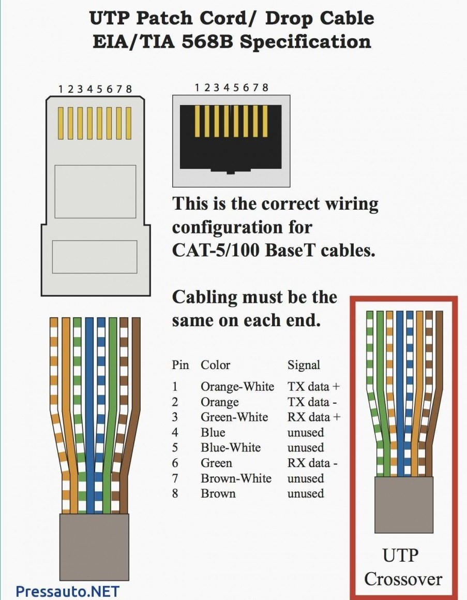

# 运维手册

T586-A

绿蓝橙棕，三五互换

T586-B

橙蓝绿棕，三五互换

百兆只用1236（橙绿）

教育网外网认证 10.6.8.2

创新港认证 10.184.6.32

STU认证 10.6.11.20

XJTU\_WLAN认证 10.6.18.6

XJTU\_STU认证 10.6.18.2

lib认证 10.6.18.5

dns 202.117.0.20 202.117.0.21

| 网络名称 | 认证页面地址 |
| ---: | :--- |
| 教育网外网认证 | 10.6.8.2 |

